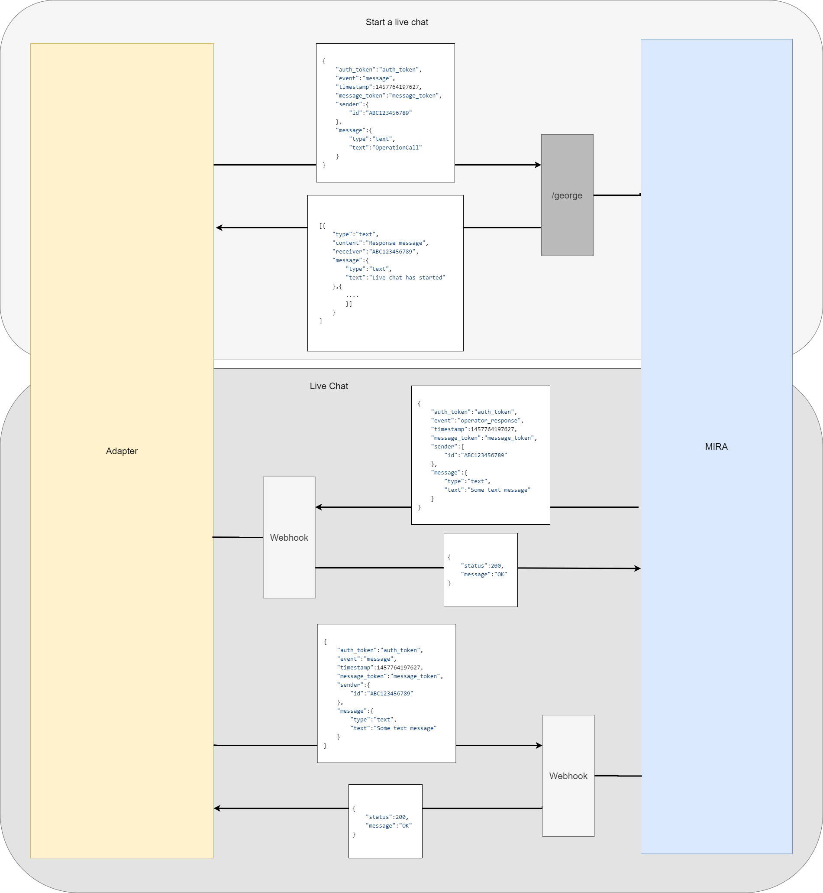

# Documentation of George Messaging prototype


##Links


[Web for testing](https://webchat-dev.azurewebsites.net/#874ef829-a81e-40c8-bde1-9abcacb590e1) Note: client has to start conversation

## Use case of PoC

- conversation handover between chatbot and agent
- communication with human agent
- conversation handover between human and chatbot


## API Documentation
### Technology handover
TBD

### API URL HU

https://uat01.botoffice.net/erstegeorgeuat/rest/webhook/george

Example Request: 

```javascript
{
	"auth_token":"Kyiv7Po1v2",
	"event":"message",
	"timestamp":1457764197627,
	"message_token":"1234567_3",
	"sender":{ 
		"id":"ABC1"
	},
	"message":{ 
		"type":"text", 
		"text":"asd" 
	}
}
```

### Protocol diagram



### Meeting minutes

#### 1.April
- Česka spořitelna will have access into test account of Mirra [on monday]
- We can test your API for sending and receiving messages [on monday]
- our platform for communication is this Viber group
- our user story we want to achieve with this first API integration:
sending and receiving messages between our router and your system
together we will design rest of APIs which is needed for communication
1/ starting a conversation
2/ ending a conversation
- next meeting is 7.4. 11am


#### 7. April
- we need service call to start conversation with human
- we need testing capacity for "human hondover" - tomorrow we know timing from HU
- @Jakub - next call - next tuesday
- @Jakub send usecases